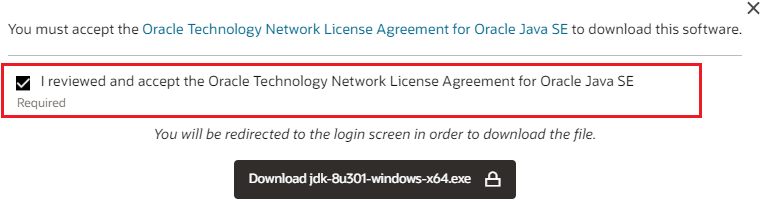
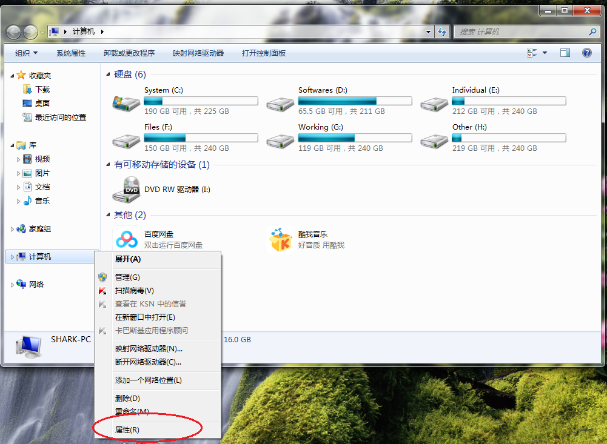
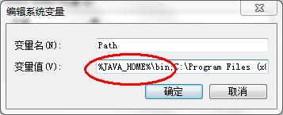
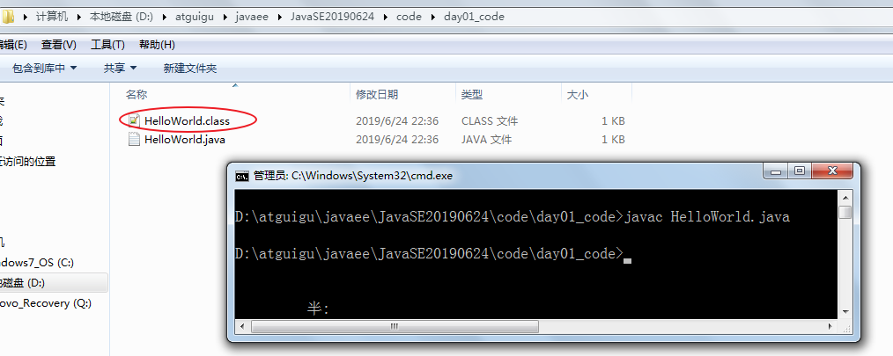
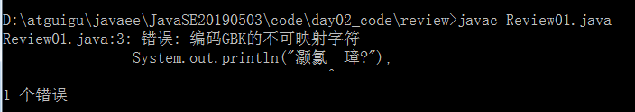
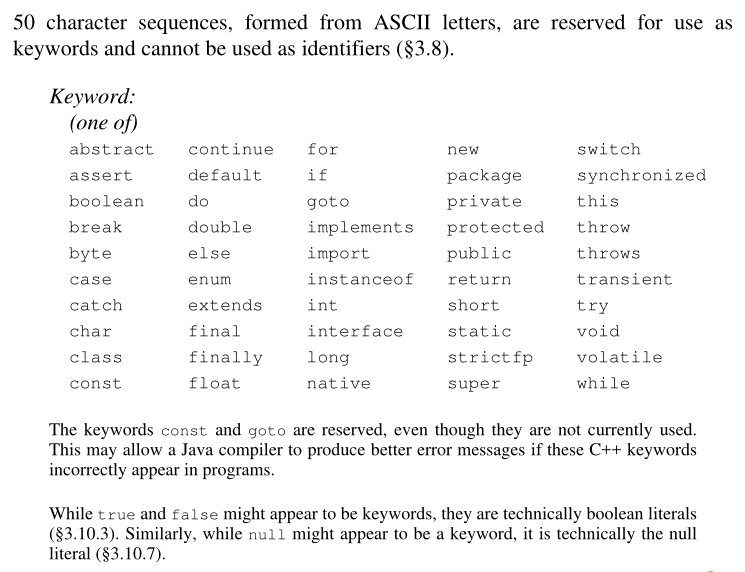

# Day1-第1章 Java概述（上午）

## 1.1 计算机语言（了解）

机器语言->汇编语言->高级语言


## 1.2 Java语言概述

### 1、发展历史（了解）

Java诞生于==SUN==（Stanford University Network），09年SUN被==Oracle==（甲骨文）收购。

==Java之父是詹姆斯.高斯林(James Gosling)==。

==Java大约26岁，我们使用的版本是Java8，最新版本Java19，最新的长期支持版本（可以用于开发的版本）是Java17.==

|   发行版本    |  发行时间  |                             备注                             |
| :-----------: | :--------: | :----------------------------------------------------------: |
|     Java      | 1995.05.23 | Sun（Stanford University Network）公司在Sun world会议上正式发布Java和HotJava浏览器 |
|   Java 1.0    | 1996.01.23 |             Sun公司发布了Java的第一个开发工具包              |
|   Java 1.1    | 1997.02.19 |                                                              |
|   Java 1.2    | 1998.12.08 |    拆分成：J2SE（标准版）、J2EE（企业版）、J2ME（小型版）    |
|   Java 1.3    | 2000.05.08 |                                                              |
|    Java1.4    | 2004.02.06 |                                                              |
| **Java 5.0**  | 2004.09.30 | ①版本号从1.4直接更新至5.0；②平台更名为JavaSE、JavaEE、JavaME |
|   Java 6.0    | 2006.12.11 |             2009.04.20 ==Oracle宣布收购SUN公司==             |
|   Java 7.0    | 2011.07.02 |                                                              |
| **Java 8.0**  | 2014.03.18 |                                                              |
|   Java 9.0    | 2017.09.22 | ①每半年更新一次（3月、9月）；②Java 9.0开始不再支持windows 32位系统 |
|   Java 10.0   | 2018.03.21 |                                                              |
| **Java 11.0** | 2018.09.25 |           JDK安装包取消独立JRE安装包，长期支持版本           |
|   Java12-16   |            |                        每半年更新一次                        |
| **Java17.0**  |   2021.9   |                    ==最新的长期支持版本==                    |
|   Java18.0    |   2022.3   |                                                              |
|   Java19.0    |   2022.9   |                                                              |

### 2、Java特点（了解）

（1）**优点**

* **面向对象、简单熟悉：**Java语言支持封装、继承、多态，面向对象编程，让程序更好达到`高内聚`，`低耦合`的标准。Java编程语言设计时保留了C++的许多面向对象特性，从而使它成为一种熟悉的语言。同时Java编程语言又删除C和C++中容易引发程序错误的复杂特性，例如：指针、运算符重载、多继承等，从而使它称为一种更简单的语言，就算没有C++编程经验的初学者也能很快学会Java。
* **健壮型：**Java的强类型机制、异常处理、垃圾的自动收集等是Java程序健壮性的重要保证。对指针的丢弃是Java的明智选择。
* **安全性高：**Java通常被用在网络环境中，为此，Java提供了一个安全机制以防恶意代码的攻击。如：安全防范机制（类ClassLoader），如分配不同的名字空间以防替代本地的同名类、字节代码检查。
* **跨平台、可移植：**Java程序（后缀为java的文件）在Java平台上被编译为体系结构中立的字节码格式（后缀为class的文件），然后可以在实现这个Java平台的任何系统中运行。
* **支持分布式、多线程、动态性：**Java语言支持编写网络应用程序，支持编程多线程程序，支持反射等动态机制。

（2）**缺点**

- 语法过于复杂，严谨，对程序员的约束比较多，与python和php等相比入门相对较难。但是一旦学会了，就业岗位需求量大，而且薪资待遇节节攀升。
- 一般适用于大型网站开发，整个架构会比较重，对于初创公司开发和维护人员的成本比较高（即薪资高），选择用Java语言开发网站或应用系统的需要一定的经济实力。

### 3、Java技术体系平台（了解）

* JavaSE（Java Platform, Standard Edition标准版）：允许您在桌面和服务器上开发和部署Java应用程序。Java提供了丰富的用户界面、性能、多功能性、可移植性和当今应用程序所需的安全性。
* JavaEE（Java Platform, Enterprise Edition企业版）：是为开发企业环境下的应用程序提供的一套解决方案，主要针对于Web应用程序开发。
* JavaME（Java Platform, Micro Edition 小型版）：为互联网上的嵌入式和移动设备上运行的应用提供了一个健壮、灵活的环境：微控制器、传感器、网关、移动电话、个人数字助理（PDA）、电视机顶盒、打印机等等。JavaME包括灵活的用户界面、健壮的安全性、内置的网络协议，以及支持动态下载的网络和离线应用程序。基于JavaME的应用程序在许多设备上都是可移植的，但是利用了每个设备的本机功能。

## 1.3 Java跨平台原理（了解）

### 1、Java语言跨平台原理


下载和安装不同平台对应的JVM


### 2、JVM、JRE、JDK的关系

- **JVM**（Java Virtual Machine ）：Java虚拟机，是运行所有Java程序的假想计算机，是Java程序的运行环境之一，也是Java 最具吸引力的特性之一。我们编写的Java代码，都运行在**JVM** 之上。
- **JRE ** (Java Runtime Environment) ：是Java程序的运行时环境，包含`JVM` 和运行时所需要的`核心类库`。
- **JDK**  (Java Development's Kit)：是Java程序开发工具包，包含`JRE` 和开发人员使用的工具。

我们想要运行一个已有的Java程序，那么只需安装`JRE` 即可。

我们想要开发一个全新的Java程序，那么必须安装`JDK` ，其内部包含`JRE`。


## 1.4 开发环境搭建（掌握）

### 1.4.1 JDK的下载

官网网址：www.oracle.com，JDK下载地址：https://www.oracle.com/java/technologies/downloads/

- 找到安装包，例如：安装环境是Windows系统基于x64处理器


- 选择同意协议




- 注册或登录后下载


### 1.4.2 JDK的安装

* 安装步骤：

  * 双击`jdk-8u202-windows-x64.exe`文件，并单击`下一步`，如图所示：

    

  * 取消独立JRE的安装，单击`公共JRE前的下拉列表`，选择`此功能将不可用`如图所示：

    

  * ==重新选择开发工具，==修改安装路径，单击更改，如图所示：

    

  * 将安装路径修改为`D:\ProgramFiles\Java\jdk1.8.0_271\`，并单击确定，如图所示：

    

  * 单击下一步，如图所示：

    

  * 稍后几秒，安装完成，如图所示：

    

  * 目录结构，如图所示：

    

### 1.4.3 配置环境变量

#### 1、为什么配置path？

希望在命令行使用javac.exe等工具时，任意目录下都可以找到这个工具所在的目录。

例如：我们在C:\Users\Irene目录下使用java命令，结果如下：


我们在JDK的安装目录的bin目录下使用java命令，结果如下：


我们不可能每次使用java.exe，javac.exe等工具的时候都进入到JDK的安装目录下，太麻烦了。我们希望在任意目录下都可以使用JDK的bin目录的开发工具，因此我们需要告诉操作系统去哪里找这些开发工具，这就需要配置path环境变量。

#### 2、设置JDK环境变量的步骤

* 打开桌面上的计算机，进入后在左侧找到`计算机`，单击鼠标`右键`，选择`属性`，如图所示：

  

* 选择`高级系统设置`，如图所示：

  

* 在`高级`选项卡，单击`环境变量`，如图所示：

  

* 在`系统变量`中，单击`新建` ，创建新的环境变量，如图所示：

  

* 变量名输入`JAVA_HOME`，变量值输入 `D:\ProgramFiles\Java\jdk1.8.0_271` ，并单击`确定`，如图所示：

  

* 选中`Path` 环境变量，`双击`或者`点击编辑` ,如图所示：

  

* 在变量值的最前面，键入`%JAVA_HOME%\bin;`  分号必须要写，而且还要是**英文符号**。如图所示：

  

  

* 环境变量配置完成，**重新开启**DOS命令行，在任意目录下输入`javac` 命令，运行成功。

  


## 1.5 入门程序HelloWorld（掌握）

### 1.5.1 HelloWorld案例

#### 1、程序开发步骤说明

JDK安装完毕，可以开发我们第一个Java程序了。

Java程序开发三步骤：**编写**、**编译**、**运行**。


#### 2、编写Java源程序保存.java源文件

1. 在`D:\atguigu\javaee\JavaSE20190624\code\day01_code` 目录下新建文本文件，完整的文件名修改为`HelloWorld.java`，其中文件名为`HelloWorld`，后缀名必须为==.java==。
2. 用notepad++等文本编辑器打开（虽然是系统自带的记事本也可以，但是记事本没有关键字颜色标识，不利于初学者学习）

3. 在文件中输入如下代码，并且==保存==：

```java
class HelloWorld {
  	public static void main(String[] args) {
    	System.out.println("HelloWorld");
  	}
}
```

> 友情提示：
>
> 每个字母和符号必须与示例代码一模一样。

第一个`HelloWord` 源程序就编写完成了，但是这个文件是程序员编写的，JVM是看不懂的，也就不能运行，因此我们必须将编写好的`Java源文件` 编译成JVM可以看懂的`字节码文件` ，也就是==.class==文件。

#### 3、编译Java源文件生成.class字节码文件

在DOS命令行中，**进入**`D:\atguigu\javaee\JavaSE20190624\code\day01_code`**目录**，使用`javac` 命令进行编译。

**方式一**：使用文件资源管理器打开`D:\atguigu\javaee\JavaSE20190624\code\day01_code`**目录**，然后在地址栏输入cmd。


方式二：在notepad++软件的文件菜单-->打开所在文件夹-->命令行（要求notepad++软件必须是用管理员权限启动的，否则会出现已经正确配置了环境变量，却仍然找不到javac命令的问题）


命令：

```java
javac Java源文件名.后缀名
```

举例：

```
javac HelloWorld.java
```



编译成功后，命令行没有任何提示。打开`D:\atguigu\javaee\JavaSE20190624\code\day01_code`目录，发现产生了一个新的文件 `HelloWorld.class`，该文件就是编译后的文件，是Java的可运行文件，称为**字节码文件**，有了字节码文件，就可以运行程序了。 

> Java源文件的编译工具`javac.exe`

#### 4、运行Java程序

在DOS命令行中，在字节码文件目录下，使用`java` 命令进行运行。

命令：

```java
java 主类名字
```

主类是指包含main方法的类，main方法是Java程序的入口，没有main方法，Java类无法独立运行：

```java
public static void main(String[] args){
    
}
```

举例：

```
java HelloWorld
```

> 友情提示：
>
> java HelloWord  不要写 不要写 不要写 .class，也不要写.java


> Java字节码文件的运行工具：java.exe

### 1.5.2 练习案例

案例：新建类AtGuiGuDemo，输出atguigu。

```java
class AtGuiGuDemo {
  	public static void main(String[] args) {
    	System.out.println("atguigu");
  	}
}
```


### 1.5.3 初学者常见错误

#### 1、单词拼写问题

* 	* 正确：class		错误：Class
   * 正确：String              错误：string
   * 正确：System            错误：system
   * 正确：main		错误：mian
* 	Java语言是一门严格区分大小写的语言

例如：


#### 2、标点符号使用问题

* 不能用中文标点符号，要使用英文半角的标点符号
* 括号和引号等成对出现

例如：


#### 3、源文件名、类名、字节码文件名的区别和联系？

（1）源文件名、类名、字节码文件名的认识


（2）源文件名是否必须与类名一致？

```java
如果这个类不是public，那么源文件名可以和类名不一致。但是不便于代码维护。不推荐这么干。
我们建议大家，不管是否是public，都与源文件名保持一致，而且一个源文件尽量只写一个类，目的是为了好维护。
```

（3）类名和字节码文件名一致？

```java
字节码文件名就是类名
```

（4）一个源文件中是否可以有多个类？

```java
一个源文件中可以有多个类，编译后会生成多个.class字节码文件。
```

#### 4、public的类

（1）class前面可以加public

```java
如果这个类是public，那么要求源文件名必须与类名一致。否则编译报错。
    
因此一个源文件只能有一个public的类。
```

（2）main方法必须在public的类中吗？

```java
不是。

但是后面写代码时，基本上main方法（主方法）习惯上都在public类中。
```

#### 5、文件名大小写问题

（1）程序代码中代码、类名等

	严格区分大小写

（2）字节码文件名

	因为字节码文件名就是类名，所以严格区分大小写
	
	java命令 主类名/字节码文件名

（3）源文件名

	在Windows操作系统中.java的源文件名不区分大小写，但是考虑到需要培养程序员严谨的工作态度，我们建议大家养成区分大小写的习惯。
	
	javac命令 源文件名.java


#### 6、字符编码问题

当cmd命令行窗口的字符编码与.java源文件的字符编码不一致，如何解决？



解决方案一：

	在Notepad++等编辑器中，修改源文件的字符编码


解决方案二：

	在使用javac命令式，可以指定源文件的字符编码

```cmd
javac -encoding utf-8 Review01.java
```


#### 7、Java程序的结构与格式

```java
类{
    方法{
        语句;
    }
}
```

格式：

（1）每一级{}缩进一个Tab键

（2）习惯{}的左半部分在行尾，右半部分单独一行，与和它成对的"{"的行首对齐


### 1.5.4 Notepad++使用问题（附加）

```java
/*
问题4：Notepad++默认设置问题
（1）Notepad++默认新建文件是UTF-8，希望Notepad++新建文件是GBK/ANSI。
设置菜单->首选项->新建->编码选ANSI

已有的文件编码设置：
编码菜单->转为ANSI编码

问题5：Notepad++默认保存类型类型是.txt，希望默认保存文件是.java
设置菜单->首选项->新建->默认语言选择Java（大多数版本设置这个就够了）
设置菜单->首选项->默认目录->去掉对勾（使用新样式...）
*/
class Problem4{
	public static void main(String[] args){
		
	}
}
```


# Day1-第2章 Java基础语法（下午）

## 2.1 注释（*comment*）（掌握）

**注释**：就是对代码的解释和说明。其目的是让人们能够更加轻松地了解代码。为代码添加注释，是十分必须要的，它不影响程序的编译和运行。

Java中有`单行注释`、`多行注释`和`文档注释`

### 1、单行注释

单行注释以 `//`开头，以`换行`结束，格式如下：


```java
// 单行注释内容
```

### 2、多行注释

多行注释以 `/*`开头，以`*/`结束，格式如下：


```java
/*
	多行注释内容
 */
```

### 3、文档注释（也可以放到面向对象部分讲）

文档注释以`/**`开头，以`*/`结束。

辅助最终会借助javadoc工具生成API文档，所以文档注释内容会借助一下特有的标记帮助，还会。

```java
/**
	文档注释内容
*/
```

文档注释的作用有两个：一个是辅助阅读源码的人员（包括代码的设计者、使用代码的开发人员、后期代码的维护人员等）快速地理解代码，另一个是使用javadoc工具生成API文档，这就使得开发人员在不打开源代码的情况下也能快速地了解源码。为了javadoc工具能正确解析文档注释，更好地生成API文档，文档注释必须按照规范的格式进行编写，通常还会借助一些特殊的标记来进行说明。例如：

- @author 标明开发该类模块的作者，多个作者之间使用,分割

* @version 标明该类模块的版本

* @see 参考转向，也就是相关主题

* @since 从哪个版本开始增加的

* @param  只能用于方法，对方法的形参进行说明，如果方法没有参数就不能写，有几个参数写几个@param，每个参数注释格式要求：@param 形参名 形参类型  形参说明

* @return 只能用于方法，对方法的返回值进行说明，每个方法最多只能有一个@return说明，如果方法的返回值类型是void就不能写@return，如果方法的返回值类型不是void就必须写@return，格式要求：@return 返回值类型 返回值说明

* @throws/@exception 只能用于方法，对方法可能抛出的异常进行说明 ，如果方法没有用throws显式抛出的异常就不能写@throws，如果方法可能发生异常就要进行说明，每一个可能发生的异常说明格式要求：@exception 异常类型 异常说明

例如：

```java
/**
文档注释演示
@author chai
*/
public class Comments{
    
	/**
	Java程序的入口
	@param String[] args main方法的命令参数
	*/
    public static void main(String[] args){
        System.out.println("hello");
    }
}
```

javadoc工具的使用格式：

```cmd
javadoc [options] [packagenames] [sourcefiles] [@files]
```

例如：

```java
javadoc -author -d doc Comments.java
```


## 2.2 关键字（*keyword*）（掌握）

**关键字**：是指在程序中，Java已经定义好的单词，具有特殊含义。

关键字的特点：全部都是小写字母。

```java
HelloWorld案例中，出现的关键字有 public、class、static、void等，这些单词已经被Java定义好。
关键字比较多，不需要今天一口气全记住，学到哪里记到哪里即可。
```

```java
Java8关键字一共50个，其中const和goto是保留字。
true,false,null看起来像关键字，但从技术角度，它们是特殊的布尔值和空值。
```



```java
Java17关键字有51个，其中const和goto、_是保留字。
strictfp是已经废弃的关键字。
true,false,null是字面常量值。
另外有16个上下文关键字，它们只在特定的位置才是关键字，否则它们就是标识符。例如：
    exports，opens，requires，uses
    module，permits，sealed，var
    non-sealed，provides，to，with
    open，record，transitive，yield
```


## 2.3 标识符( identifier)（掌握）

简单的说，凡是程序员自己命名的部分都可以称为标识符。

即给类、变量、方法、包等命名的字符序列，称为标识符。

更多细节详见《代码整洁之道.pdf》《阿里的Java开发手册》

### 2.3.1 标识符的命名规则

标识符的命名规则：必须遵守的硬性规则

（1）Java的标识符只能使用26个英文字母大小写，0-9的数字，下划线_，美元符号$

（2）不能使用Java的关键字（包含保留字）和特殊值

（3）数字不能开头

（4）不能包含空格

（5）严格区分大小写

### 2.3.2 标识符的命名规范

 标识符的命名规范：建议遵守的软性规则，否则容易被鄙视和淘汰

（1）见名知意

（2）类名、接口名等：每个单词的首字母都大写，形式：XxxYyyZzz，

例如：HelloWorld，String，System等

（3）变量、方法名等：从第二个单词开始首字母大写，其余字母小写，形式：xxxYyyZzz，

例如：age,name,bookName,main

（4）包名等：每一个单词都小写，单词之间使用点.分割，形式：xxx.yyy.zzz，

例如：java.lang;

自己命名的包不能以java开头，习惯上以公司域名倒置的写法，例如：com.atguigu.bean;

（5）常量名等：每一个单词都大写，单词之间使用下划线_分割，形式：XXX_YYY_ZZZ，

例如：MAX_VALUE,PI

## 2.4 初识数据类型(data type)（掌握）

Java的数据类型分为两大类：

- **基本数据类型**：包括 `整数`、`浮点数`、`字符`、`布尔`。 
- **引用数据类型**：包括`数组`、 `类`、`接口`、`枚举`、`注解`、`记录`。 


## 2.5 常量值（*literal value*）（掌握）

**常量值：用于表示在编译时就可以确定的数据值，并且在程序执行的过程中其值不可以发生改变**

```java
例如：整数最大值：9223372036854775807，
     圆周率pi的值：3.14159265358979323846，
     自然底数e的值：2.7182818284590452354，
     《三国演义》的作者：罗贯中
    李清照的性别：女
```

常量值的分类和表示：

|          类型          |          举例           |
| :--------------------: | :---------------------: |
|       整数常量值       | 12，-23, 1567844444557L |
|       浮点常量值       |   12.34F，12.34，12D    |
|       字符常量值       |     ‘a’，'0'，‘尚’      |
|       布尔常量值       |       true，false       |
|      字符串常量值      |    "HelloWorld"、""     |
| 引用数据类型空值常量值 |          null           |


- 整数常量值，超过int范围的必须加L或l（小写L）
- 小数常量值，无论多少，不加F，就是double类型，也可以在数字后面加D或d表示double类型。要表示float类型，必须加F或f
- char常量值，必须使用单引号
- String字符串常量值，必须使用双引号

```java
public class ConstantDemo {
	public static void main(String[] args) {		
		//输出整数常量值
		System.out.println(12);
		System.out.println(-23);
        System.out.println(235265954566L);
		
		//输出小数常量值
        System.out.println(12.34F);
		System.out.println(12.34);
        System.out.println(12D);
		
		//输出字符常量值
		System.out.println('a');
		System.out.println('0');
        System.out.println('尚');
		
		//输出布尔常量值
		System.out.println(true);
		System.out.println(false);
        
        //输出字符串常量值
		System.out.println("HelloWorld");
        System.out.println("");
        
        //输出空值常量值
		System.out.println(null);
	}
}
```

## 2.6 变量（*variable*）（掌握）

### 2.6.1 变量的概念

**变量：用来表示可以在程序执行的过程中才能确定的数据值，或者在程序执行期间可以修改的数据值**

变量的作用：用来存储数据，代表内存的一块存储区域，这块内存中的值是可以改变的。


### 2.6.2 变量的声明

```java
数据类型  变量名;
例如：
//存储一个整数类型的年龄
int age; 

//存储一个小数类型的体重
double weight;

//存储一个单字符类型的性别 
char gender;

//存储一个布尔类型的婚姻状态
boolean marry;

//存储一个字符串类型的姓名
String name;

//声明多个同类型的变量
int a,b,c; //表示a,b,c三个变量都是int类型。
```

> 注意：变量的数据类型可以是基本数据类型，也可以是引用数据类型。

### 2.6.3 变量的赋值

给变量赋值，就是把“值”存到该变量代表的内存空间中。

1、变量赋值的语法格式

```java
变量名 = 值;
```

- 给变量赋值，变量名必须在=左边，值必须在=右边
- 给变量赋的值类型必须与变量声明的类型一致或兼容（<=）

2、可以使用合适类型的常量值给变量赋值

```java
int age = 18;
double weight = 44.4;
char gender = '女';
boolean marry = true;
String name = "柴林燕";
```

**long类型：如果赋值的常量整数超过int范围，那么需要在数字后面加L。**

**float类型：如果赋值为常量小数，那么需要在小数后面加F。**

**char类型：使用单引号''**

**String类型：使用双引号""**

3、可以使用其他变量或者表达式给变量赋值

```java
int m = 1;
int n = m;
        
int x = 1;
int y = 2;
int z = 2 * x + y;
```

### 2.6.4 变量值的输出

```java
//输出变量的值
System.out.println(age);

//输出变量的值
System.out.println("年龄：" + age);
System.out.println("age：" + age);
System.out.println("name" + name + ",age = " + age + "，gender = " + gender + ",weight = " + weight + ",marry = " + marry);
```

> ()中填写的是要输出的某个值。
>
> 如果某些内容想要原样输出，就用""引起来，而要输出变量中的内容，则不要把变量名用""引起来
>
> +的左右两边有""表示的字符串的话，意义是拼接多项内容为一个值。

### 2.6.5 变量可以反复赋值

- 变量的第一次赋值称为初始化；
- 变量的再赋值称为修改变量的值；
- 上一行变量值的修改对下一行的计算会产生影响；

```java
//先声明，后初始化
char gender;
gender = '女';

//声明的同时初始化
int age = 18;
System.out.println("age = " + age);///age = 18

//给变量重新赋值，修改age变量的值
age = 19;
System.out.println("age = " + age);//age = 19
```

### 2.6.6 变量的三要素

1、数据类型

- 变量的数据类型决定了在内存中开辟多大空间
- 变量的数据类型也决定了该变量可以存什么值

2、变量名

- 见名知意非常重要

3、值

- 基本数据类型的变量：存储数据值

- 引用数据类型的变量：存储地址值，即对象的首地址。例如：String类型的变量存储的是字符串对象的首地址（关于对象后面章节再详细讲解）

### 2.6.7 变量的使用应该注意什么？

1、先声明后使用

> 如果没有声明，会报“找不到符号”错误

2、在使用之前必须初始化

> 如果没有初始化，会报“未初始化”错误

3、变量有作用域

> 如果超过作用域，也会报“找不到符号”错误

4、在同一个作用域中不能重名

5、变量值的类型必须与变量声明的类型一致或兼容（<=）

```java
一致：一样
int age = 18;  18是int类型的常量值，age也是int类型

    
兼容：可以装的下，=右边的值要 小于等于 =左边的变量类型
long bigNum =18; 18是int类型的常量值，bigNum是long类型
int < long

int age = 18L; 错误  18L是long类型的常量值，age是int类型
long > int
```

### 2.6.8 变量的使用案例

案例需求：随机产生一个[0,1)的小数，用它表示某个圆的半径，然后输出圆的面积和周长的值。

开发提示：

- 通过Math.random()可以随机产生一个[0,1)的小数。
- 圆周率用3.14159265358979323846表示。
- Java中用*表示乘法。

```java
class TestCircle {
    public static void main(String[] args) {
        double radius = Math.random();
        double area = 3.14159265358979323846 * radius * radius;
        double perimeter = 2 * 3.14159265358979323846 * radius;
        System.out.println("本次圆半径值是：" + radius);
        System.out.println("面积是：" + area);
        System.out.println("周长是：" + perimeter);
    }
}
```


## 2.7 最终变量/常量（final）

最终变量习惯上也称为常量，因为它是通过在声明变量的数据类型前面加final的方式实现的，所以叫最终变量。加final修饰后，这个变量的值就不能修改了，一开始赋值多少，就是多少，所以此时的变量名通常称为常量名。常量名通常所有字母都大写，每一个单词之间使用下划线分割，从命名上和变量名区分开来。

这样做的好处：

- 可读性更好
- 便于维护

案例需求：随机产生两个[0,1)的小数，分别用它表示两个圆的半径，然后输出对应圆的面积和周长的值。

开发提示：

- 通过Math.random()可以随机产生一个[0,1)的小数。
- 圆周率用3.14159265358979323846表示。
- Java中用*表示乘法。

```java
class TestNoFinal {
    public static void main(String[] args) {
        double radius1 = Math.random();
        double area1 = 3.14159265358979323846 * radius1 * radius1;
        double perimeter1 = 2 * 3.14159265358979323846 * radius1;
        System.out.println("第1个圆半径值是：" + radius1);
        System.out.println("第1个圆面积是：" + area1);
        System.out.println("第1个圆周长是：" + perimeter1);

        double radius2 = Math.random();
        double area2 = 3.14159265358979323846 * radius2 * radius2;
        double perimeter2 = 2 * 3.14159265358979323846 * radius2;
        System.out.println("第2个圆半径值是：" + radius2);
        System.out.println("第2个圆面积是：" + area2);
        System.out.println("第2个圆周长是：" + perimeter2);
    }
}
```

```java
public class TestUseFinal {
    public static void main(String[] args) {
//        final double PI = 3.14159265358979323846;
        final double PI = 3.14;
        double radius1 = Math.random();
        double area1 =  PI * radius1 * radius1;
        double perimeter1 = 2 * PI * radius1;
        System.out.println("第1个圆半径值是：" + radius1);
        System.out.println("第1个圆面积是：" + area1);
        System.out.println("第1个圆周长是：" + perimeter1);

        double radius2 = Math.random();
        double area2 = PI * radius2 * radius2;
        double perimeter2 = 2 * PI * radius2;
        System.out.println("第2个圆半径值是：" + radius2);
        System.out.println("第2个圆面积是：" + area2);
        System.out.println("第2个圆周长是：" + perimeter2);
    }
}
```


