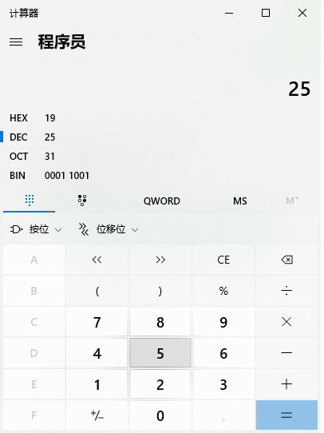
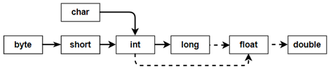
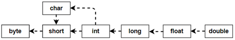
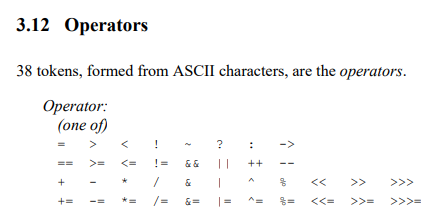

# Day2-第2章 Java基础语法（续）

## 2.8  计算机如何存储数据

计算机世界中只有二进制。那么在计算机中存储和运算的所有数据都要转为二进制。包括数字、字符、图片、声音、视频等。

### 2.8.1 进制

#### 1、进制的分类

|          | 十进制   | 二进制   | 八进制                     | 十六进制                     |
| -------- | -------- | -------- | -------------------------- | ---------------------------- |
| 数字范围 | 0-9      | 0-1      | 0-7                        | 0-9，a-f                     |
| 进位规则 | 逢十进一 | 逢二进一 | 逢八进一                   | 逢十六进一                   |
| 示例     | 125      | 01111101 | 175                        | 7D                           |
| 说明     |          |          | 每三位二进制是一位八进制值 | 每四位二进制是一位十六进制值 |

#### 2、进制的换算（了解）

#### 3、程序员模式计算器（了解）

| 项目 | 说明     |
| ---- | -------- |
| HEX  | 十六进制 |
| DEC  | 十进制   |
| OCT  | 八进制   |
| BIN  | 二进制   |



#### 4、在代码中如何表示四种进制的常量值

请分别用四种类型的进制来表示10，并输出它的结果：（了解）

```java
（1）十进制：正常表示
System.out.println(10);

（2）二进制：0b或0B开头
System.out.println(0B10);

（3）八进制：0开头
System.out.println(010);

（4）十六进制：0x或0X开头
System.out.println(0X10);
```

### 2.8.2 计算机存储单位（掌握）


- **字节（Byte）：**是计算机信息技术用于计量存储容量的一种计量单位，一字节等于八位。

- **位（bit）：**是数据存储的最小单位。也就是二进制。二进制数系统中，每个0或1就是一个位，叫做bit（比特），其中8 bit 就称为一个字节(Byte)。

- **转换关系：**
  - 8 bit = 1 Byte
  - 1024 Byte = 1 KB
  - 1024 KB = 1 MB
  - 1024 MB = 1 GB
  - 1024 GB = 1 TB

### 2.8.3 Java的基本数据类型的存储范围


float：单精度浮点型，占内存：4个字节，精度：科学记数法的小数点后6~7位

double：双精度浮点型，占内存：8个字节，精度：科学记数法的小数点后15~16位

### 2.8.4 计算机如何表示数据（理解）

#### 1、原码、反码、补码与符号位概念

计算机数据的存储使用二进制补码形式存储，并且最高位是符号位，最高位1是负数，最高位0是正数。

```java
1个字节数据，xyyyyyyy：x是符号位,y是数据位
2个字节数据，xyyyyyyy yyyyyyyy：x是符号位,y是数据位
4个字节数据，xyyyyyyy yyyyyyyy  yyyyyyyy  yyyyyyyy：x是符号位,y是数据位

x是1表示负数
x是0表示正数
```

*规定：正数的补码与反码、原码一样，称为三码合一；负数的补码与反码、原码不一样：*

​       *正数的原码：把十进制转为二进制，最高位是0*

​	   *负数的原码：把十进制转为二进制，然后最高位设置为1*

​	   *负数的反码：在原码的基础上，最高位不变，其余位取反（0变1,1变0）*

​	   *负数的补码：反码+1*

#### 2、如何表示boolean值？

true底层使用1表示。

false底层使用0表示。

#### 3、如何表示整数？

```java
以byte整数为例byte类型（1个字节，8位）：
正数：25   00011001（原码）
正数：25   00011001（反码）
正数：25   00011001（补码）

负数：-25  00011001（原码）
负数：-25  11100110（反码）
负数：-25  11100111（补码）
```

一个字节可以存储的整数范围是多少？

```java
以一个字节为例：
正数范围：00000001 ~ 01111111（二进制）
	    1      ~  127	 （十进制）
负数范围：10000001 ~ 11111111（二进制）	
		-127   ~ -1
	10000001（补码）
	10000000（反码）
	11111111（原码）==>对应十进制 -127
	
	11111111（补码）
	11111110（反码）
	10000001（原码）
零： 00000000  ==> +0
    10000000  ==>-0（用来表示负0没意义），用它表示-128
	
	满足如下等式：
	-127		- 1		   = -128
	10000001	- 00000001 = 10000000（二进制）
```

#### 4、如何表示小数？

* ==float（4个字节）比long（8个字节）的存储范围大==
* ==loat和double不精确==
* ==double（8个字节）比float（4个字节）精度范围大==

因为float、double底层也是二进制，先把小数转为二进制，然后把二进制表示为科学记数法，然后只保存：

①符号位②指数位（需要移位）③尾数位

> *详见《float型和double型数据的存储方式.docx》*

#### 5、如何表示单个字符？

（1）使用单引号将单个字符引起来：例如：'A'，'0'，'尚'

```java
char c = '尚';//使用单引号
String s = '尚';//错误的，哪怕是一个字符，也要使用双引号
		
char kongChar = '';//错误，单引号中有且只能有一个字符
String kongStr = "";//可以，双引号中可以没有其他字符，表示是空字符串
```

（2）特殊的转义字符

```java
\n：换行
\r：回车
\t：Tab键
\\：\
\"："
\'：'
\b：删除键Backspace
```

```java
public class TestEscapeCharacter {
    public static void main(String[] args){
        System.out.println("hello\tjava");
        System.out.println("hello\rjava");
        System.out.println("hello\njava");
        System.out.println("hello\\world");
        System.out.println("\"hello\"");
        char shuang = '"';
        System.out.println(shuang + "hello" + shuang);
        System.out.println("'hello'");
        char dan ='\'';
        System.out.println(dan + "hello" + dan);
    }
}
```

```java
public class TestTab {
    public static void main(String[] args){
        System.out.println("hello\tworld\tjava.");
        System.out.println("chailinyan\tis\tbeautiful.");
        System.out.println("姓名\t基本工资\t年龄");
        System.out.println("张三\t10000.0\t23");
    }
}
```

（3）用十进制的0~65535之间的Unicode编码值，表示一个字符

在JVM内存中，一个字符占2个字节，Java使用Unicode字符集来表示每一个字符，即每一个字符对应一个唯一的Unicode编码值。char类型的数值参与算术运算或比较大小时，都是用编码值进行计算的。

| 字符 | Unicode编码值 |
| ---- | ------------- |
| '0'  | 48            |
| '1'  | 49            |
| 'A'  | 65            |
| 'B'  | 66            |
| 'a'  | 97            |
| 'b'  | 98            |
| '尚' | 23578         |

```java
char c1 = 23578;
System.out.println(c1);//尚

char c2 = 97;
System.out.println(c2);//a

//如何查看某个字符的Unicode编码？
//将一个字符赋值给int类型的变量即可
int codeOfA = 'A';
System.out.println(codeOfA);

int codeOfShang = '尚';
System.out.println(codeOfShang);

int codeOfTab = '\t';
System.out.println(codeOfTab);
```

（4）\u字符的Unicode编码值的十六进制型

例如：'\u5c1a'代表'尚'

```java
char c = '\u0041'; //十进制Unicode值65，对应十六进制是41，但是\u后面必须写4位
char c = '\u5c1a'; //十进制Unicode值23578，对应十六进制是5c1a
```

学生疑问：一个字符到底占几个字节？

在JVM内存中，一个字符占2个字节，Java使用Unicode字符集来表示每一个字符，即每一个字符对应一个唯一的Unicode编码值。char类型的数值参与算术运算或比较大小时，都是用编码值进行计算的。

在文件中保存或网络中传输时文本数据时，和环境编码有关。如果环境编码选择ISO8859-1（又名Latin），那么一个字符占一个字节；如果环境编码选择GBK，那么一个字符占1个或2个字节；如果环境编码选择UTF-8，那么一个字符占1-4个字节。（后面讲String类时再详细讲解）

## 2.9  基本数据类型转换（Conversion）（掌握）

在Java程序中，不同的基本数据类型的值经常需要进行相互转换。Java语言所提供的**七种数值类型**之间可以相互转换，基本数据类型转换有两种转换方式：自动类型转换和强制类型转换。==boolean类型不参与。==

### 2.9.1 自动类型转换（隐式类型转换）

**自动转换**：

 * 将`取值范围小的类型`自动提升为`取值范围大的类型` 。

基本数据类型的转换规则如图所示：



（1）当把存储范围小的值（常量值、变量的值、表达式计算的结果值）赋值给了存储范围大的变量时。

```java
int i = 'A';//char自动升级为int，其实就是把字符的编码值赋值给i变量了
double d = 10;//int自动升级为double

byte b = 127; //右边的整数常量值必须在-128~127范围内
//byte bigB = 130;//错误，右边的整数常量值超过byte范围
long num = 1234567; //右边的整数常量值如果在int范围呢，编译和运行都可以通过，这里涉及到数据类型转换
long bigNum = 12345678912L;//右边的整数常量值如果超过int范围，必须加L，否则编译不通过
```

（2）当存储范围小的数据类型与存储范围大的数据类型一起混合运算时，会按照其中最大的类型运算。

```java
int i = 1;
byte b = 1;
double d = 1.0;

double sum = i + b + d;//混合运算，升级为double
```

（3）当byte,short,char数据类型进行算术运算时，按照int类型处理。

```java
byte b1 = 1;
byte b2 = 2;
byte b3 = b1 + b2;//编译报错，b1 + b2自动升级为int

char c1 = '0';
char c2 = 'A';
System.out.println(c1 + c2);//113 
```

### 2.9.2 强制类型转换（显式类型转换）

将`1.5` 赋值到`int` 类型变量会发生什么？产生编译失败，肯定无法赋值。

```java
int i = 3.14; // 错误
```

想要赋值成功，只有通过强制类型转换，将`double` 类型强制转换成`int` 类型才能赋值。

* **强制类型转换**：将`取值范围大的类型`强制转换成`取值范围小的类型`。

 比较而言，自动转换是Java自动执行的，而强制转换需要我们自己手动执行。

**转换格式：**

```java
数据类型 变量名 = （数据类型）被强转数据值;  //()中的数据类型必须<=变量的数据类型，一般都是=
```

（1）当把存储范围大的值（常量值、变量的值、表达式计算的结果值）赋值给了存储范围小的变量时，需要强制类型转换，提示：有风险，可能会损失精度或溢出



```java
int i = (int)3.14;//强制类型转换，损失精度

double d = 1.2;
int num = (int)d;//损失精度

int i = 200;
byte b = (byte)i;//溢出
```

（2）当某个值想要提升数据类型时，也可以使用强制类型转换

```java
int i = 1;
int j = 2;
double shang = (double)i/j;
```

提示：这个情况的强制类型转换是没有风险的。

### 2.9.3 基本数据类型与字符串类型的转换

1、任意数据类型的数据与String类型进行“+”运算时，结果一定是String类型

```java
System.out.println("" + 1 + 2);//12
```

2、但是String类型不能通过强制类型()转换，转为其他的类型

```java
String str = "123";
int num = (int)str;//错误的
int num = Integer.parseInt(str);//后面才能讲到，借助包装类的方法才能转
```


## 2.10 运算符（Operator）（掌握）

在Java8中，一共有38个运算符。



### 2.10.1 运算符的分类

（1）按照功能分：算术运算符、赋值运算符、比较运算符、逻辑运算、条件运算符、Lambda运算符

|          分类           |                        运算符                        |
| :---------------------: | :--------------------------------------------------: |
|    算术运算符（7个）    |                +、-、*、/、%、++、--                 |
|   赋值运算符（12个）    | =、+=、-=、*=、/=、%=、>>=、<<=、>>>=、&=、\|=、^=等 |
| 关系、比较运算符（6个） |                 >、>=、<、<=、==、!=                 |
|    逻辑运算符（6个）    |                &、\|、^、!、&&、\|\|                 |
|    条件运算符（2个）    |                条件表达式?结果1:结果2                |
|     位运算符（7个）     |               &、\|、^、~、<<、>>、>>>               |
|   Lambda运算符（1个）   |                     ->（后面学）                     |

（2）按照操作数个数分：一元运算符（单目运算符）、二元运算符（双目运算符）、三元运算符 （三目运算符）

|           分类            |                  运算符                  |
| :-----------------------: | :--------------------------------------: |
| 一元运算符（单目运算符）  |    正号（+）、负号（-）、++、--、!、~    |
| 二元运算符（双目运算符）  | 除了一元和三元运算符剩下的都是二元运算符 |
| 三元运算符 （三目运算符） |         (条件表达式)?结果1:结果2         |

### 2.10.2 赋值运算符（上）

赋值运算符分为两种：

- 最基础的赋值运算符：=
- 组合的赋值运算符：+=、-=、*=、/=、%=、>>=、<<=、>>>=、&=、\|=、^=等

```java
public class AssignOperator1 {
	public static void main(String[] args) {
		int a = 3;
		int b = 4;
        int c = a + b;        

		System.out.println(a); // 3
		System.out.println(b); // 4	
        System.out.println(c); //7
        System.out.println("--------------------------");
        
        a = b;
        System.out.println(a); // 4	  a被重新赋值为b变量的值4
		System.out.println(b); // 4	  b并没有被重新赋值
        System.out.println(c); //7	  7并没有被重新赋值
    }
}
```

运算规则和要求：

```java
（1）=左边一定是一个变量，右边可以是常量、变量、表达式
（2）赋值运算一定是最后算的，优先级最低
（3）=右边值的类型必须 “小于等于” 左边变量的类型
```

### 2.10.3 算术运算符

|  算术运算符   |            符号解释             |
| :-----------: | :-----------------------------: |
|      `+`      | 加法运算，字符串连接运算，正号  |
|      `-`      |         减法运算，负号          |
|      `*`      |            乘法运算             |
|      `/`      | 除法运算，整数/整数结果还是整数 |
|      `%`      | 求余运算，余数的符号只看被除数  |
| `++` 、  `--` |          自增自减运算           |

#### 1、加减乘除模

```java
public class OperatorDemo01 {
	public static void main(String[] args) {
		int a = 3;
		int b = 4;
		
		System.out.println(a + b);// 7
		System.out.println(a - b);// -1
		System.out.println(a * b);// 12
		System.out.println(a / b);// 计算机结果是0，为什么不是0.75呢？
		System.out.println(a % b);// 3
        
        System.out.println(5%2);//1
		System.out.println(5%-2);//1
		System.out.println(-5%2);//-1
		System.out.println(-5%-2);//-1		
		//商*除数 + 余数 = 被除数
		//5%-2  ==>商是-2，余数时1    (-2)*(-2)+1 = 5
		//-5%2  ==>商是-2，余数是-1   (-2)*2+(-1) = -4-1=-5
	}
}
```

####  2、“+”号的三种用法

* 第一种：对于`+`两边都是数值的话，`+`就是加法的意思
* 第二种：对于`+`两边至少有一边是字符串的话，`+`就是拼接的意思
* 第三种：对于+作为一元运算符的话，+就是表示正号的意思

```java
public class OperatorDemo02 {
	public static void main(String[] args) {
		// 字符串类型的变量基本使用
		// 数据类型 变量名称 = 数据值;
		String str1 = "Hello";
		System.out.println(str1); // Hello
		
		System.out.println("Hello" + "World"); // HelloWorld
		
		String str2 = "Java";
		// String + int --> String
		System.out.println(str2 + 520); // Java520
		// String + int + int
		// String		+ int
		// String
		System.out.println(str2 + 5 + 20); // Java520
        
        int a = 5;
        int b = +a;
        int c = -a;
        System.out.println("a = " + a);
        System.out.println("b = " + b);
        System.out.println("c = " + c);
	}
}
```

#### 3、自加自减运算

**理解：**`++`  **运算，变量自己的值加1**。反之，`--` 运算，变量自己的值减少1，用法与`++` 一致。

1、单独使用

* 变量在单独运算的时候，变量`前++`和变量`后++`，变量的是一样的；
* 变量`前++`   ：例如 `++a` 。
* 变量`后++`   ：例如 `a++` 。

```java
public class OperatorDemo3 {
	public static void main(String[] args) {
		// 定义一个int类型的变量a
		int a = 3;
		//++a;
		a++;
        // 无论是变量前++还是变量后++，结果都是4
		System.out.println(a);
	}
}
```

2、复合使用

* 和`其他变量放在一起使用`或者和`输出语句放在一起使用`，`前++`和`后++`就产生了不同。

- 变量`前++` ：变量先自身加1，然后再取值。
- 变量`后++` ：变量先取值，然后再自身加1。

```java
public class OperatorDemo03 {
	public static void main(String[] args) {
		// 其他变量放在一起使用
		int x = 3;
		//int y = ++x; // y的值是4，x的值是4，
		int y = x++; // y的值是3，x的值是4
		
		System.out.println(x);
		System.out.println(y);
		System.out.println("==========");
        
		// 和输出语句一起
		int z = 5;
		//System.out.println(++z);// 输出结果是6，z的值也是6
		System.out.println(z++);// 输出结果是5，z的值是6
		System.out.println(z);
        
        int a = 1;
        a = a++;//(1)先取a的值“1”放操作数栈(2)a再自增,a=2(3)再把操作数栈中的"1"赋值给a,a=1

        int i = 1;
        int j = i++ + ++i * i++;
        /*
        从左往右加载
        (1)先算i++
        ①取i的值“1”放操作数栈
        ②i再自增 i=2
        （2）再算++i
        ①i先自增 i=3
        ②再取i的值“3”放操作数栈
        （3）再算i++
        ①取i的值“3”放操作数栈
        ②i再自增 i=4
        （4）先算乘法
        用操作数栈中3 * 3 = 9，并把9压会操作数栈
        （5）再算求和
        用操作数栈中的 1 + 9 = 10
        （6）最后算赋值
        j = 10
        */
	} 
}
```

* 小结：
  * **++在前，先自加，后使用；**
  * **++在后，先使用，后自加。**

### 2.10.4 关系运算符/比较运算符

| 关系运算符 |                           符号解释                           |
| :--------: | :----------------------------------------------------------: |
|    `<`     |  比较符号左边的数据是否小于右边的数据，如果小于结果是true。  |
|    `>`     |  比较符号左边的数据是否大于右边的数据，如果大于结果是true。  |
|    `<=`    | 比较符号左边的数据是否小于或者等于右边的数据，如果大于结果是false。 |
|    `>=`    | 比较符号左边的数据是否大于或者等于右边的数据，如果小于结果是false。 |
|    `==`    |          比较符号两边数据是否相等，相等结果是true。          |
|   `！=`    |     不等于符号 ，如果符号两边的数据不相等，结果是true。      |

* 比较运算符，是两个数据之间进行比较的运算，运算结果一定是boolean值`true`或者`false` 。
* 其中>,<,>=,<=不支持boolean，String类型，==和!=支持boolean和String。

```java
public class OperatorDemo05 {
	public static void main(String[] args) {
		int a = 3;
		int b = 4;

		System.out.println(a < b); // true
		System.out.println(a > b); // false
		System.out.println(a <= b); // true
		System.out.println(a >= b); // false
		System.out.println(a == b); // false
		System.out.println(a != b); // true
	}
}
```

### 2.10.5 逻辑运算符

* 逻辑运算符，是用来连接两个布尔类型值的运算符（`!`除外），运算结果也是boolean值`true`或者`false`

| 逻辑运算符 |   符号解释   |               符号特点               |
| :--------: | :----------: | :----------------------------------: |
|    `&`     |    与，且    |          有`false`则`false`          |
|    `|`     |      或      |           有`true`则`true`           |
|    `^`     |     异或     |     相同为`false`，不同为`true`      |
|    `!`     |      非      | 非`false`则`true`，非`true`则`false` |
|    `&&`    | 双与，短路与 |      左边为false，则右边就不看       |
|    `||`    | 双或，短路或 |       左边为true，则右边就不看       |

&&和&区别，||和|区别：

* **`&&`和`&`**区别：
  * `&&`和`&`结果一样，`&&`有短路效果，左边为false，右边不执行；`&`左边无论是什么，右边都会执行。
* **`||`和`|`**区别：
  * `||`和`|`结果一样，`||`有短路效果，左边为true，右边不执行；`|`左边无论是什么，右边都会执行。

```java
public class OperatorDemo06 {
	public static void main(String[] args) {
		int a = 3;
		int b = 4;
		int c = 5;

		// & 与，且；有false则false
		System.out.println((a > b) & (a > c)); 
		System.out.println((a > b) & (a < c)); 
		System.out.println((a < b) & (a > c)); 
		System.out.println((a < b) & (a < c)); 
		System.out.println("===============");
		// | 或；有true则true
		System.out.println((a > b) | (a > c)); 
		System.out.println((a > b) | (a < c)); 
		System.out.println((a < b) | (a > c));
		System.out.println((a < b) | (a < c));
		System.out.println("===============");
		// ^ 异或；相同为false，不同为true
		System.out.println((a > b) ^ (a > c));
		System.out.println((a > b) ^ (a < c)); 
		System.out.println((a < b) ^ (a > c)); 
		System.out.println((a < b) ^ (a < c)); 
		System.out.println("===============");
		// ! 非；非false则true，非true则false
		System.out.println(!false);
		System.out.println(!true);
        
        //&和&&的区别
        System.out.println((a > b) & (a++ > c)); 
        System.out.println("a = " + a);
        System.out.println((a > b) && (a++ > c)); 
        System.out.println("a = " + a);
        System.out.println((a == b) && (a++ > c)); 
        System.out.println("a = " + a);
        
        //|和||的区别
        System.out.println((a > b) | (a++ > c)); 
        System.out.println("a = " + a);
        System.out.println((a > b) || (a++ > c)); 
        System.out.println("a = " + a);
        System.out.println((a == b) || (a++ > c)); 
        System.out.println("a = " + a);
	}
}
```

```java
/*
3、逻辑运算符
逻辑与：&
	true & true 结果是true
	true & false 结果是false
	false & true 结果是false
	false & false 结果是false
	
	只有两个边都是true，结果才为true。

逻辑或：|
	true | true 结果是true
	true | false 结果是true
	false | true 结果是true
	false | false 结果是false
	
	只要有一边是true，结果就为true。
	
逻辑非：!
	!true  变为false
	!false 变为true
	
逻辑异或：^
	true | true 结果是false
	true | false 结果是true
	false | true 结果是true
	false | false 结果是false
	
	只有两边不一样，一个是true，一个是false，结果才为true。
	
短路与：&&
	true && true 结果是true
	true && false 结果是false
	false && ? 结果是false
	false && ? 结果是false
	
	只有两个边都是true，结果才为true。
	但是它如果左边已经是false，右边不看。这样的好处就是可以提高效率。

	
短路或：||
	true || ？ 结果是true
	true || ？ 结果是true
	false || true 结果是true
	false || false 结果是false
	
	只要有一边是true，结果就为true。
	但是它如果左边已经是true，右边就不看了。这样的好处就是可以提高效率。

特殊：
（1）逻辑运算符的操作数必须是boolean值
（2）逻辑运算符的结果也是boolean值

*/
public class LogicOperator{
	public static void main(String[] args){
		/*
		表示条件，成绩必须在[0,100]之间
		成绩是int类型变量score
		*/
		int score = 56;
		
		//System.out.println(0<=score<=100);
		/*
		LogicOperator.java:23: 错误: 二元运算符 '<=' 的操作数类型错误
                System.out.println(0<=score<=100);
                                           ^
		  第一个类型:  boolean    0<=score的结果 true
		  第二个类型: int
		  
		  true <= 100？不对的
		1 个错误*/
		
		System.out.println(0<=score  & score<=100);
		
	}
}
```

### 2.10.6 条件运算符

- 条件运算符格式：

```java
条件表达式？结果1：结果2
```

- 条件运算符计算方式：
  - 条件判断的结果是true，条件运算符整体结果为结果1，赋值给变量。
  - 判断条件的结果是false，条件运算符整体结果为结果2，赋值给变量。

```java
public static void main(String[] args) {
    int i = (1==2 ? 100 : 200);
    System.out.println(i);//200
    int j = (3<=4 ? 500 : 600);
    System.out.println(j);//500
}
```

```java
public class ConditionOperator{
	public static void main(String[] args){
		//判断两个变量a,b谁大，把大的变量赋值给max
		int a = 2;
		int b = 2;
		int max = a >= b ? a : b;
		//如果a>=b成立，就取a的值赋给max，否则取b的值赋给max
		System.out.println(max);
		
		boolean marry = false;
		System.out.println(marry ? "已婚" : "未婚"  );
	}
}
```

